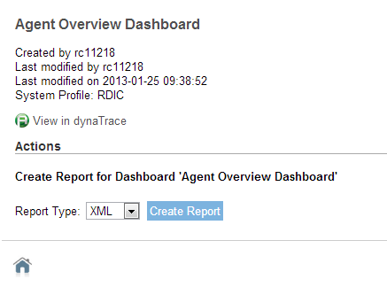
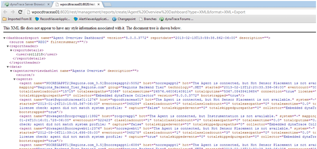
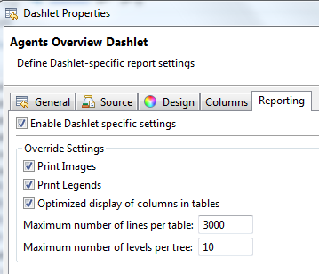
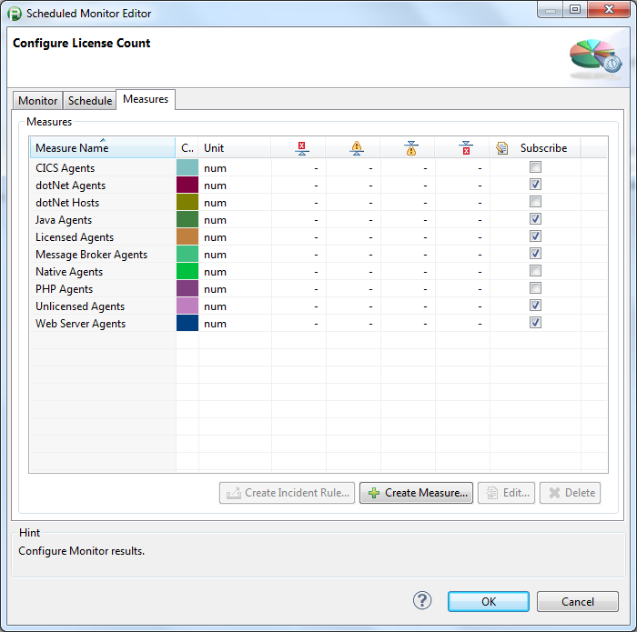
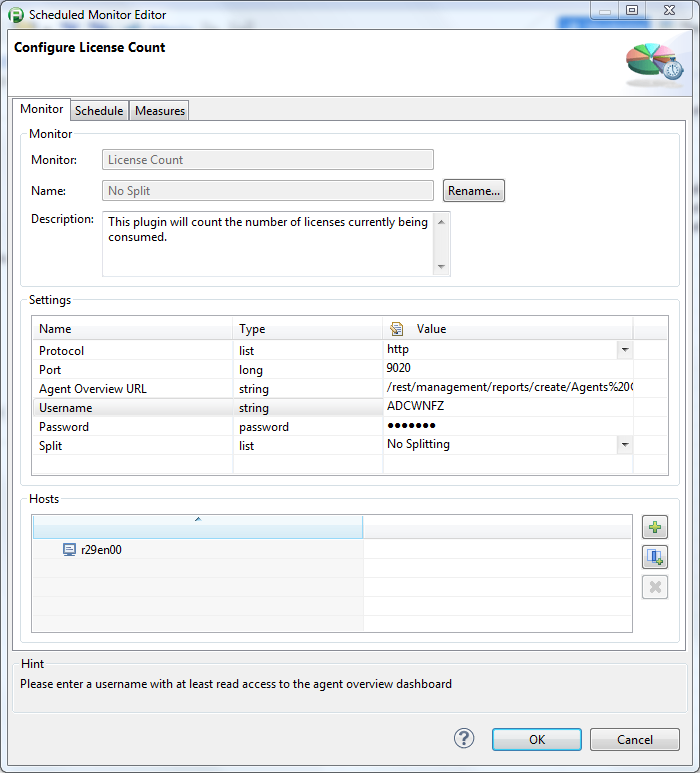
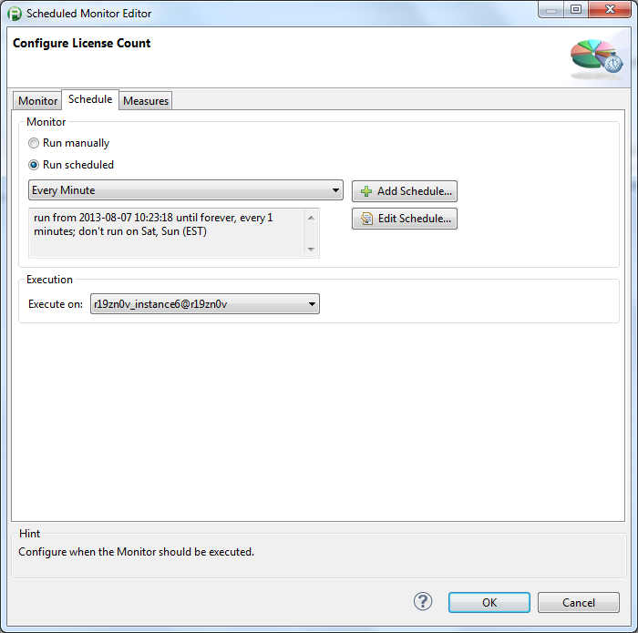
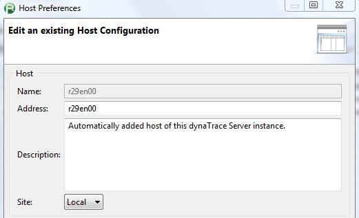
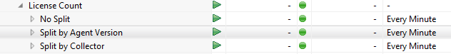
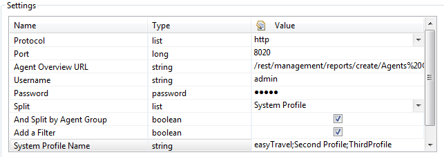
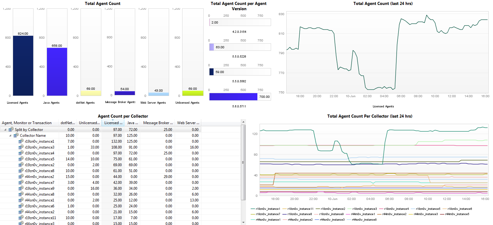

<html xmlns="http://www.w3.org/1999/xhtml">
<head>
    <title>License Count</title>
    <meta http-equiv="Content-Type" content="text/html; charset=UTF-8"/>
    <meta http-equiv="X-UA-Compatible" content="IE=EmulateIE8" />
    <meta content="Scroll Wiki Publisher" name="generator"/>
    <link type="text/css" rel="stylesheet" href="css/blueprint/liquid.css" media="screen, projection"/>
    <link type="text/css" rel="stylesheet" href="css/blueprint/print.css" media="print"/>
    <link type="text/css" rel="stylesheet" href="css/content-style.css" media="screen, projection, print"/>
    <link type="text/css" rel="stylesheet" href="css/screen.css" media="screen, projection"/>
    <link type="text/css" rel="stylesheet" href="css/print.css" media="print"/>
</head>
<body>
                <h1>License Count</h1>
    

        <h2>Overview</h2>
    

    

            
            

The license count plugin queries the agent overview to get the licenses being currently utilized by technology.    

    

    

    

The plugin supports both HTTP and HTTPS.    

    

The plugin uses dynaTrace REST Interface to query the following metrics:    

    

        <table>
<thead class=" "></thead><tfoot class=" "></tfoot><tbody class=" ">    <tr>
            <td rowspan="1" colspan="1">
    <ul class=" "><li class=" ">    

Total licenses used    

</li><li class=" ">    

Total agents not licensed    

</li><li class=" ">    

Java agents    

</li><li class=" ">    

.Net agents    

</li><li class=" ">    

.Net Hosts    

</li></ul>            </td>
                <td rowspan="1" colspan="1">
    <ul class=" "><li class=" ">    

Web Server agents    

</li><li class=" ">    

Message Broker agents    

</li><li class=" ">    

Native agents    

</li><li class=" ">    

PHP agents    

</li><li class=" ">    

CICS agents    

</li></ul>            </td>
        </tr>
</tbody>        </table>
            

    

The plugin can filter or dynamically split on the following items:    

    

        <table>
<thead class=" "></thead><tfoot class=" "></tfoot><tbody class=" ">    <tr>
            <td rowspan="1" colspan="1">
    <ul class=" "><li class=" ">    

System Profile    

</li><li class=" ">    

Collector    

</li><li class=" ">    

System Profile/Agent Group    

</li></ul>            </td>
                <td rowspan="1" colspan="1">
    <ul class=" "><li class=" ">    

Host    

</li><li class=" ">    

Agent Version    

</li></ul>            </td>
        </tr>
</tbody>        </table>
            

    

    

        <h2>Plugin Details</h2>
    

        <table>
<thead class=" "></thead><tfoot class=" "></tfoot><tbody class=" ">    <tr>
            <td rowspan="1" colspan="1">
        

Plug-In Files    

            </td>
                <td rowspan="1" colspan="1">
        

<a href="attachments_163546835_1_com.dynatrace.license.count_1.7.0.jar">com.dynatrace.license.count_1.7.0.jar</a>    

    

<a href="attachments_150700212_1_System_Health_-_License_Count.dashboard.xml">System Health - License Count.dashboard.xml</a>    

            </td>
        </tr>
    <tr>
            <td rowspan="1" colspan="1">
        

Author    

            </td>
                <td rowspan="1" colspan="1">
        

Shaun Gautz (<a href="mailto:shaun.gautz@compuware.com">shaun.gautz@compuware.com</a>)    

    

Michael Beemer (<a href="mailto:michael.beemer@compuware.com">michael.beemer@compuware.com</a>)    

            </td>
        </tr>
    <tr>
            <td rowspan="1" colspan="1">
        

dynaTrace Versions    

            </td>
                <td rowspan="1" colspan="1">
        

4.2+, 5.5+    

            </td>
        </tr>
    <tr>
            <td rowspan="1" colspan="1">
        

License    

            </td>
                <td rowspan="1" colspan="1">
        

<a href="attachments_5275722_2_dynaTraceBSD.txt">dynaTrace BSD</a>    

            </td>
        </tr>
    <tr>
            <td rowspan="1" colspan="1">
        

Support    

            </td>
                <td rowspan="1" colspan="1">
        

<a href="https://community/pages/createpage.action?spaceKey=DTFORUM&amp;title=Support+Levels">Not Supported</a>    

            </td>
        </tr>
    <tr>
            <td rowspan="1" colspan="1">
        

Known Problems    

            </td>
                <td rowspan="1" colspan="1">
        

    

            </td>
        </tr>
    <tr>
            <td rowspan="1" colspan="1">
        

Release History    

            </td>
                <td rowspan="1" colspan="1">
        

2014-04-21 Added support for multiple filters, dynamic splits for System Profile/Agent Group,    

    

and enhanced 'finer' level of logging    

    

2014-01-28 Added support for HTTPS    

    

2014-01-10 Dynamic splits and added agent types    

    

2013-03-28 Split by System Profile and bug fixes 2013-02-13 Initial Release    

            </td>
        </tr>
    <tr>
            <td rowspan="1" colspan="1">
        

Previous Release 1.1    

    

Previous Release 1.5    

    

Previous Release 1.6    

            </td>
                <td rowspan="1" colspan="1">
        

<a href="attachments_116523392_1_com.dynatrace.license.count_1.1.0.jar">com.dynatrace.license.count_1.1.0.jar</a>    

    

<a href="attachments_150700207_1_com.dynatrace.license.count_1.5.0.jar">com.dynatrace.license.count_1.5.0.jar</a>    

    

<a href="attachments_155123724_1_com.dynatrace.license.count_1.6.0.jar">com.dynatrace.license.count_1.6.0.jar</a>    

            </td>
        </tr>
</tbody>        </table>
            

    

    

        <h2>Configuration</h2>
    

This plugin requires that you first save the Agent Overview as a dashboard on the dynaTrace server. Make sure the maximum number of lines per table is larger than the number of agents, or the xml will be cutoff. Once the dashboard is saved, use a web browser to navigate to the <a href="http://server_name:8020">http://server_name:8020</a>, by default, or <a href="https://server_name:8021,">https://server_name:8021,</a> if you are using HTTPS. Once at the home page, navigate to View Dashboard &amp; Reports -&gt; Agent Overview Dashboard (or whatever you named it) -&gt; Details -&gt; Report Type is XML -&gt; Create Report. Use this URL on the Monitor tab. <strong class=" ">Starting in version 1.6, the Monitor screen has the URL split out.</strong> <strong class=" ">One box is for protocol, one is for port, and another is for the rest of the URL</strong> (/rest/...).    

    

    

    

        <table>
<thead class=" "></thead><tfoot class=" "></tfoot><tbody class=" ">    <tr>
            <td rowspan="1" colspan="1">
        

            
            

            </td>
                <td rowspan="1" colspan="1">
        

            
            

            </td>
                <td rowspan="1" colspan="1">
        

            
            

            </td>
        </tr>
    <tr>
            <td rowspan="1" colspan="1">
                </td>
                <td rowspan="1" colspan="1">
                </td>
                <td rowspan="1" colspan="1">
                </td>
        </tr>
</tbody>        </table>
            

    

Once you have the plugin installed and created, then you can create a new monitor, as shown in the following screenshots.    

    

    

    

        <table>
<thead class=" "></thead><tfoot class=" "></tfoot><tbody class=" ">    <tr>
            <td rowspan="1" colspan="1">
        

            
            

            </td>
                <td rowspan="1" colspan="1">
        

            
            

            </td>
                <td rowspan="1" colspan="1">
        

            
            

            </td>
        </tr>
    <tr>
            <td rowspan="1" colspan="1">
                </td>
                <td rowspan="1" colspan="1">
                </td>
                <td rowspan="1" colspan="1">
                </td>
        </tr>
</tbody>        </table>
            

    

The plugin now uses the host you selected for the monitor. It uses the Address block of that host. You may need to change this, if it doesn't work by default.    

    

            
            

    

Use the following Monitor names to work with the dashboard:    

    

            
            

    

You may add a filter, if you only want to see one System Profile or Collector. <strong class=" ">Starting in version 1.7, you can use multiple filters separated by a semicolon</strong>,<strong class=" "> such as &quot;easyTravel;Second Profile;ThirdProfile&quot;. </strong>    

    

            
            

    

    

        <h2>Results</h2>
    

The following screenshot shows a dashboard displaying some of the measures queried by the monitor:    

    

            
            

    

    

        <h2>Things to consider</h2>
<ol class=" "><li class=" ">    

Since it's a measure, it polls on a schedule instead of when the agent count changes    

</li><li class=" ">    

The filtering does not use regex and is case sensitive    

</li><li class=" ">    

The count for .Net hosts is based off the number of servers not CLRs. There is a separate value for Net Agents    

</li><li class=" ">    

Requires a username and password with at least read access to the REST interface    

</li><li class=" ">    

Not all of the agent types are included here. If you have an agent you would like added, add a comment below    

</li><li class=" ">    

If you have many hosts, splitting by host may take several minutes to get all the data    

</li></ol>    

    

        <h2>Updates</h2>
    

The new 1.7.0 update adds support for multiple filters, separated by a semicolon. It adds splitting by System Profile/Agent Group and adds enhanced 'finer' level of logging.    

    

The new 1.6.0 update adds support for a dT server running over HTTPS.    

    

The new 1.5.0 update adds the option to split dynamically on system profile, collector name, agent version, and host name. You can still filter for one item, or you can leave the filter blank and the monitor will pull all of the items that have a license count. Several agents were also added to the available metrics.    

    

    

    

Legacy    

    

The new 1.1.0 update adds an option to split by a system profile name. If you are going to use this feature, it might be a good idea to name the license count measure based on the system profile to avoid confusion. Also, keep in mind that the system profile name must match exactly or the count will be zero. Special thanks to Rajesh for the feedback on this.    

    

            

        

        

        

    

</body>
</html>
